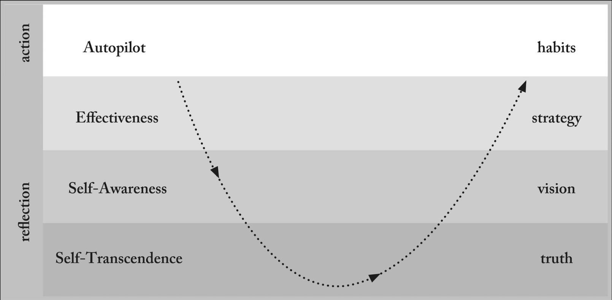

## Book Link

* https://www.lifeworthlivingbook.com/

# Role in my life

This book was something that helped me focus my thoughts and gave me a strong sense of direction when I realized I was lost. This was a book recommended by my therapist after going through some traumatic events and it served as a guided reflection. My personal philosophy changed quite dramatically after reading this book and I reoriented my life toward more than just work.

## Impactful Quotes (to me)

 > 
 > \[!quote\] 
 > It is possible to succeed in our highest aspirations and yet fail as human beings.

 > 
 > \[!quote\] 
 > If we get on board and do a good job playing within the system, we can wind up with lives that plenty of people are willing to tell us matter greatly. The world around us can insist that we’re succeeding even though we’re devoting ourselves to nothing of deep significance. And in a way, we are succeeding. It’s just a hollow success. The worst part is we won’t have more than the faintest idea how hollow it is unless we’ve learned to stay in touch with the Question.

 > 
 > \[!quote\]
 > The problem is, what matters most will not clamor for your attention. It’s rarely loud. It’s almost never flashy. It’s easy to miss. And it can be hard to hold on to. Coming to an insight about what matters most is like uncovering a precious, fragile treasure buried in the desert. Unless you mark it and shield it from the wind, the sands of life will blow over the top of it and swallow it back up. Unless you excavate it carefully, it will be lost forever. So stick with it. Carve out moments of stillness to return to the Question. Early in the morning, before the noise of the day begins. Late in the evening, when the clamor has begun to die down. Right in the middle of the workday, when you can wrest a few minutes from the hands of life’s tasks and demands. Whenever and however you can, make space for the Question. Dare to make it a topic of conversation with the people you value most. If you feel you’ve found a treasure, return to it again and again—to what matters most. Excavate it. Build your life around it. Become so devoted to it that the thought that your life is meaningless becomes laughable. Become so enamored with it that the trivialities that try to pass as significant appear as empty as they truly are. Keep pursuing the Question. Live for what matters most. Your life is worth it.

 > 
 > \[!quote\] Peter Singer
 > Why should our failure to be moral change what it means to be moral?

 > 
 > \[!quote\] Volf
 > More often, perhaps, what snaps us out of it is a person. If we’re lucky, it’s a friend or mentor kindly letting us know that we’re not living up to our own standards. Maybe like the mentor who once pointed out to Matt that the way he was treating one of his friends was “unbecoming” of him. It still stings. 
 > 
 > But people who care for us often call us out in order to call us forward. They want to see us grow and live in sync with our values.

## 4 Modes of Being

The book describes 4 "modes of being" and I realized that during my time [Working at Amazon](../My%20Experiences/Working%20at%20Amazon.md) I had fallen into the Autopilot and Effectiveness but I had not taken the time and space to deeply reflect and go a layer deeper to reorient my goals toward achieving a meaningful life.

* "Reflexive", "AutoPilot", acting spontaneously
* "Effectiveness"
* "Self-Awareness"
* "Self-Transcendence"
  
