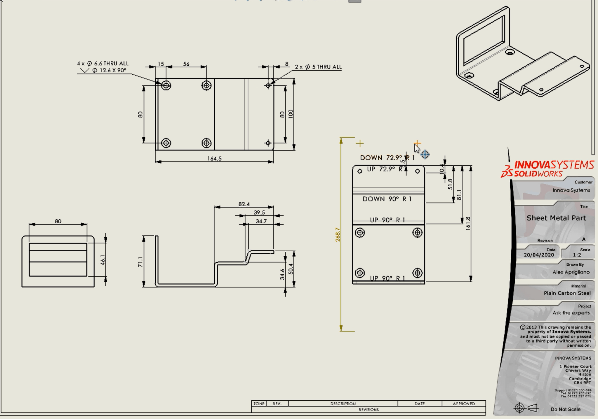

# My Experience

In senior year of high school, I was obsessed with Robotics and I was an active member of [FIRST Robotics](https://www.firstinspires.org/). I learned Computer-Aided Design (CAD), specifically [Solidworks](https://www.solidworks.com/), and I decided that I wanted to become a Mechanical Engineer. It was my dream to work on designing parts and I loved the process of creating with software. I worked with other students who would actually machine out the parts I designed for the robot and I learned how to make detailed and correct diagrams, like the one here:

Sadly, after applying to every school with a declared major of Mechanical Engineering, I was rejected from all of them for Mechanical Engineering. Luckily, I was accepted by 2 universities for my "backup major" (some schools let you choose two majors, your primary and secondary if you don't get accepted into your primary). I was accepted into UCSD and UCSB as a *Mathematics Major* which changed my trajectory significantly. I would say that if I was accepted as a Mechanical Engineer somewhere, it is very likely that I would be a Mechanical Engineer today.

After weighing the pros and cons of both UCSB and UCSD, I found that UCSD's stats were higher than UCSB, but that the social reputation of UCSD (UC Socially Dead) was significantly worse than UCSB. As most wannabe engineers do, I made my choice based on the data without taking into account the party culture into the equation.

## Life at Warren College

// TODO - Warren was chill

## Life at Revelle College

// TODO - Revelle was pretty great

## Overall Experience

// TODO - Overall Positive. Very challenging but in a good way
