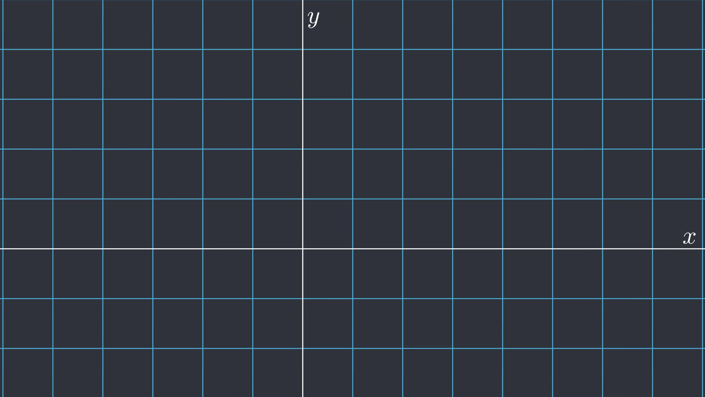

## What is Manim?

[Manim](https://docs.manim.community/en/stable/index.html) is a math animation tool originally created and open sourced by [Grant Sanderson](https://www.3blue1brown.com/about) from [3Blue1Brown](https://www.youtube.com/@3blue1brown). During a pivotal undergraduate math class called "Introduction to Proofs", I specifically remember how elegant all of the problems were on my final exam. One proof in particular stood out to me that I wanted to explain and I ended up [Learning Manim](../../Blog%20Posts/Learning%20Manim.md) to do so.

## Code Example

````python title="Coordinate Plane"
# Create the coordinate plane
plane = NumberPlane(
	x_range=[-7, 9],
	x_length=16,
	y_range=[-4, 6],
	y_length=10
)
labels = plane.get_axis_labels(x_label="x", y_label="y")
````

## Example Output


