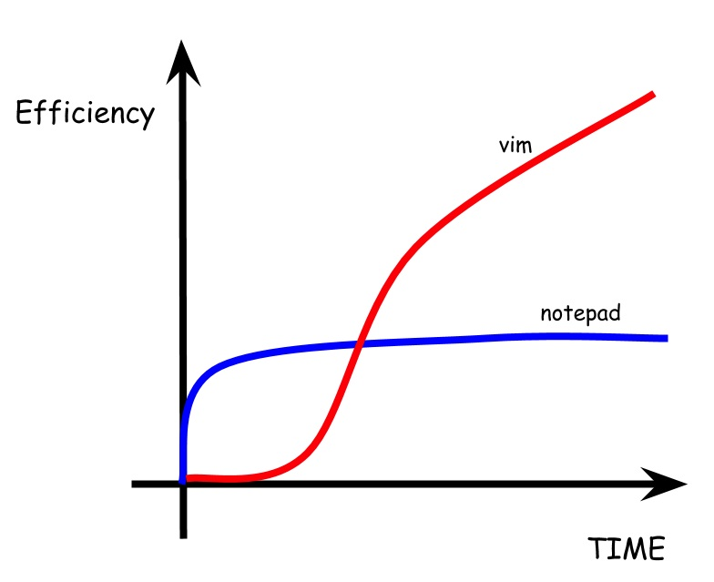

# What is Vim?

Vim is a text editor. It was designed with a keyboard centered approach to navigating and editing text. There is a steep learning curve but after spending the time to learn the basics a vim user can far surpass a normal IDE user in terms of editing text quickly and jumping to exact places in the file they are editing.

## Vim Learning Curve

